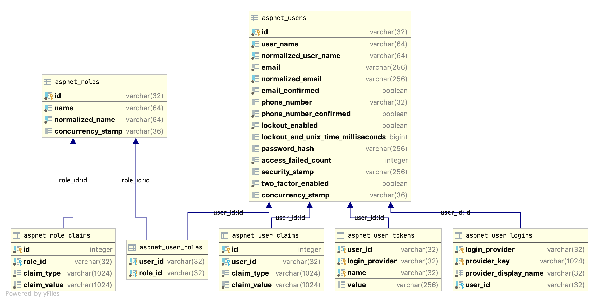

# NHibernate.AspNetCore.Identity

ASP.NET Core Identity Provider implemented with NHibernate



Nuget package:

- [NHibernate.AspNetCore.Identity](https://www.nuget.org/packages/NHibernate.AspNetCore.Identity/)

## About Version

- 5.0.x is compatible with .Net 5.0.x;
- 3.1.x is compatible with .Net Core 3.1.x;
- 3.0.x is compatible with .Net Core 3.0.x;

## Usage

### 1. Create a Asp.Net Core Mvc Project with identity support

```sh
dotnet new mvc --auth Individual
```

### 2. Add reference to `NHibernate.AspNetCore.Identity` and `NHibernate.NetCore`

```sh
dotnet add package NHibernate.AspNetCore.Identity
dotnet add package NHibernate.NetCore
```

> `NHibernate` will be installed automatically.

### 3. Setup database

- Use the sql scripts in `database` folder to create aspnet identity related tables, only support postgresql, mssql and mysql now;

  > If you want other database support, please let me know, any issue, pull request is welcome!

- Config NHibernate to use your database;

### 4. Change `Startup.cs` to use database and nhibernate

```cs
public class Startup {

    public void ConfigureServices(
        IServiceCollection services
    ) {
        // Remove EFCore stores.
        // services.AddDbContext<ApplicationDbContext>(
        // options =>
        //     options.UseSqlite(Configuration.GetConnectionString("DefaultConnection")));
        // services.AddDefaultIdentity<IdentityUser>()
        //     .AddEntityFrameworkStores<ApplicationDbContext>();

        // Add Hibernate stores
        var cfg = new Configuration();
        var file = Path.Combine(
            AppDomain.CurrentDomain.BaseDirectory,
            "hibernate.config"
        );
        cfg.Configure(file);
        // Add identity mapping based on dialect config (dialet must contains
        // PostgreSQL, MySQL, MsSql or Sqlite)
        cfg.AddIdentityMappings();
        // using default xml mapping.
        cfg.AddAssembly(typeof(Startup).Assembly);
        // using `NHibernate.Mapping.ByCode`, please comment the line above,
        // and uncomment line flowing lines;
        // var modelMapper = new NHibernate.Mapping.ByCode.ModelMapper();
        // modelMapper.AddMapping<WebTest.Entities.AppRoleMapping>();
        // modelMapper.AddMapping<WebTest.Entities.AppUserMapping>();
        // modelMapper.AddMapping<WebTest.Entities.TodoItemMapping>();
        // var mappings = modelMapper.CompileMappingForAllExplicitlyAddedEntities();
        // cfg.AddMapping(mappings);

        services.AddHibernate(cfg);
        services.AddDefaultIdentity<WebTest.Entities.ApplicationUser>()
            .AddRoles<WebTest.Entities.ApplicationRole>()
            .AddHibernateStores();

    }
}
```

> Note: When using with SqlServer, you need add `System.Data.SqlClient` package to your project.

For more detailed samples, please look at the [WebTest](https://github.com/nhibernate/NHibernate.AspNetCore.Identity/tree/master/test/WebTest) project.

## Credits

Special thanks to the following individuals, organisations and projects whose work is so important to the success of NHibernate (in no particular order):

- [NUnit](https://nunit.org/) - unit testing;
- [JetBrains](https://www.jetbrains.com/?from=NHibernate.AspNetCore.Identity) - open source license;
